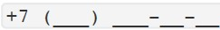
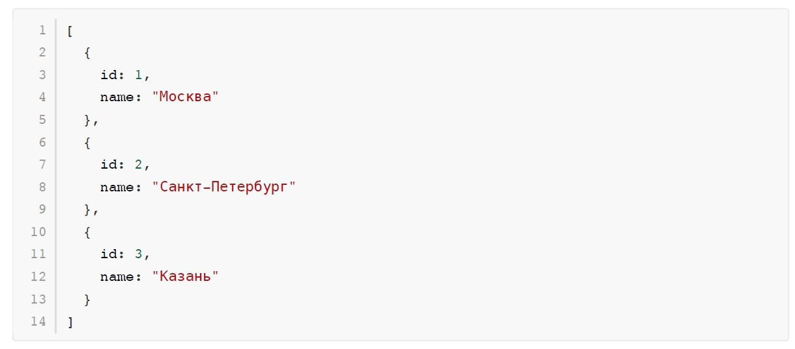
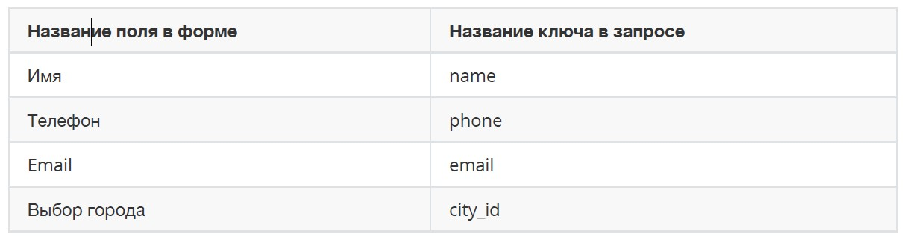
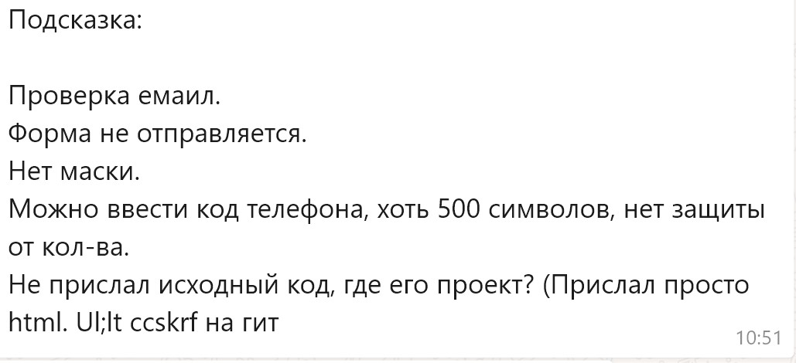

autodrive-test

# **Тестовое задание**

#### **TailwindCSS, VueJS 2/3, Vuex, Axios**

**Общее описание**

Необходимо сверстать две кнопки "Заказать в Москву" и "Заказать в Санкт-Петербург". При клике на любую из кнопок открывается попап с формой. В форме должны быть поля "Имя", "Телефон", "Email" и селект "Город", а также кнопка "Отправить". При успешном заполнении формы, данные необходимо отправить на backend, а ответ вывести в новом попапе.

При выполнении задания требуется использовать:

* VueJS в качестве основного фреймворка (v2 или v3 - на ваше усмотрение);
* TailwindCSS в качестве CSS-фреймворка;
* Vuex для пробрасывания данных между компонентами;
* Axios для общения с backend.

  P.S. Pixel-perfect делать необязательно. При небольших отклонениях стилей в дизайне от TailwindCSS-
  классов, предпочтение отдавать TailwindCSS-классам.

**Детальное описание**

**Кнопки**

Кнопки необходимо положить в отдельный компонент. Напрямую к попапу кнопки обращаться не могут.
При клике на кнопку "Заказать в Москву" в попапе в селекте "Город" должна автоматически выбираться "Москва".
При клике на кнопку "Заказать в Санкт-Петербурге" в попапе в селекте "Город" должен автоматически выбираться "Санкт-Петербург".

**Форма**

Все поля обязательные, если при клике на кнопку "Отправить" какое либо поле не заполнено либо
наполнено неверно, то возле этих полей нужно вывести ошибку "Обязательно поле".
На поле "Телефон" необходимо добавить маску номера в формате .

Форму можно отправить только, если:

* Все обязательные поля заполнены
* Введен валидный номер телефона
* Введен валидный email

При клике на "Отправить" необходимо отправлять POST-запрос backend.

В качестве массива городов для селекта взять следующий:



**Запрос**

Запрос на backend должен уходить на адрес [http://hh.autodrive-agency.ru/testtasks/front/task-7/](https://) .

Названия ключей:



Телефон передавать в формате +79999999999 .

В ответ на запрос будет приходить HTML с информацией об успешной оправки либо с информацией об ошибке, информацию неодходимо отобразить в новом попап окне.

После успешной отправки необходимо очищать форму, чтобы при повторном клике на кнопку открывалась пустая форма.

**Критерии оценки реализации:**

1. Выполение всех требований в задании;
2. Соблюдение чистоты кода;
3. Naming компонентов, методов и переменных.



```

```
